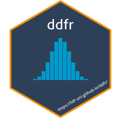

# ddfr <a href="https://fdf-uni.github.io/ddfr/"></a>

<!-- badges: start -->
[](https://github.com/fdf-uni/ddfr/actions/workflows/R-CMD-check.yml)
<!-- badges: end -->

The goal of `ddfr` is to make it easier to work with *D*iscrete *D*istributions with *F*inite support in *R*.

For specific details, you can check out the [website](https://fdf-uni.github.io/ddfr/) (in case you aren't already reading this there) which is also linked in the description of the package's [GitHub repository](https://github.com/fdf-uni/ddfr/).

Especially the [Introduction](https://fdf-uni.github.io/ddfr/articles/introduction/) should provide you with all relevant information to get started with the package.
After having installed the package, you can also access it within `R` using:
``` r
vignette("introduction", "ddfr")
```
Alternatively, if you'd prefer to view it in your browser, there is also:
``` r
browseVignettes("ddfr")
```

## Installation

You can install the development version of `ddfr` like so:

``` r
remotes::install_github("fdf-uni/ddfr")
```

## Example

This is a basic example which shows some of `ddfr`'s features:

``` r
library(ddfr)
# Create uniform distribution on {1, ..., 6}
dist <- unif(6)

# Get some information about the distribution
expected_value(dist)
variance(dist)

# Convolve it with itself
conv(dist, dist)
# This can also be done a bit quicker
dist * dist

# Plot the probability mass function of a binomial distribution
plot_pmf(bin(20, 0.3))
```
