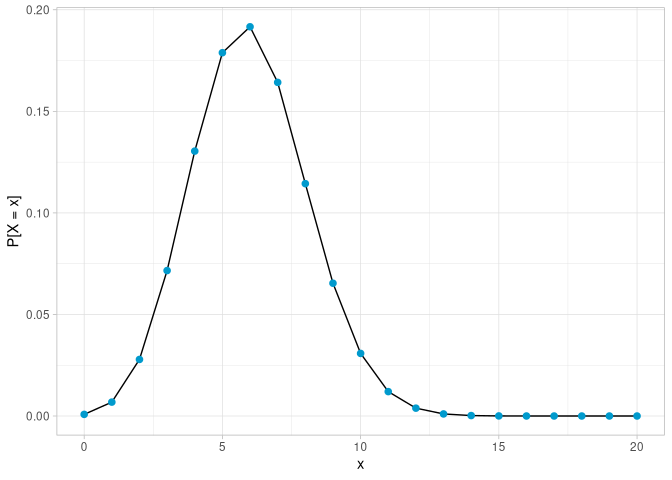

# ddfr <a href="https://fdf-uni.github.io/ddfr/"></a>

<!-- badges: start -->

[](https://github.com/fdf-uni/ddfr/actions/workflows/R-CMD-check.yaml)
<!-- badges: end -->

The goal of `ddfr` is to make it easier to work with *D*iscrete
*D*istributions with *F*inite support in *R*.

For specific details, you can check out the
[website](https://fdf-uni.github.io/ddfr/) (in case you aren’t already
reading this there) which is also linked in the description of the
package’s [GitHub repository](https://github.com/fdf-uni/ddfr/).

Especially the [Introduction to
ddfr](https://fdf-uni.github.io/ddfr/articles/ddfr.html) should provide
you with all relevant information to get started with the package. If
you installed the package with the relevant option (see “Installation”),
you can also access this vignette within `R` using:

``` r
vignette("ddfr")
```

Alternatively, if you’d prefer to view it in your browser, there is
also:

``` r
browseVignettes("ddfr")
```

## Installation

You can install the development version of `ddfr` like so:

``` r
# install.packages("remotes")
remotes::install_github("fdf-uni/ddfr")
```

If you want to be able to access the vignettes from within `R` as
described above, use:

``` r
remotes::install_github("fdf-uni/ddfr", build_vignettes = TRUE)
```

## Example

This is a basic example which shows some of `ddfr`’s features:

``` r
library(ddfr)
# Create uniform distribution on {1, ..., 6}
dist <- unif(6)

# Get some information about the distribution
expected_value(dist)
#> [1] 3.5
variance(dist)
#> [1] 2.916667

# Convolve it with itself
conv(dist, dist)
#> A convolution 
#> 
#> Support:
#>  [1]  2  3  4  5  6  7  8  9 10 11 12
#> 
#> Probabilities:
#>  [1] 0.02777778 0.05555556 0.08333333 0.11111111 0.13888889 0.16666667
#>  [7] 0.13888889 0.11111111 0.08333333 0.05555556 0.02777778

# This can also be done a bit quicker
dist * dist
#> A convolution 
#> 
#> Support:
#>  [1]  2  3  4  5  6  7  8  9 10 11 12
#> 
#> Probabilities:
#>  [1] 0.02777778 0.05555556 0.08333333 0.11111111 0.13888889 0.16666667
#>  [7] 0.13888889 0.11111111 0.08333333 0.05555556 0.02777778

# Quickly get the probability of 4 according to the convolution
pmf(dist * dist)(4)
#> [1] 0.08333333

# Plot the probability mass function of a binomial distribution
plot_pmf(bin(20, 0.3))
```


